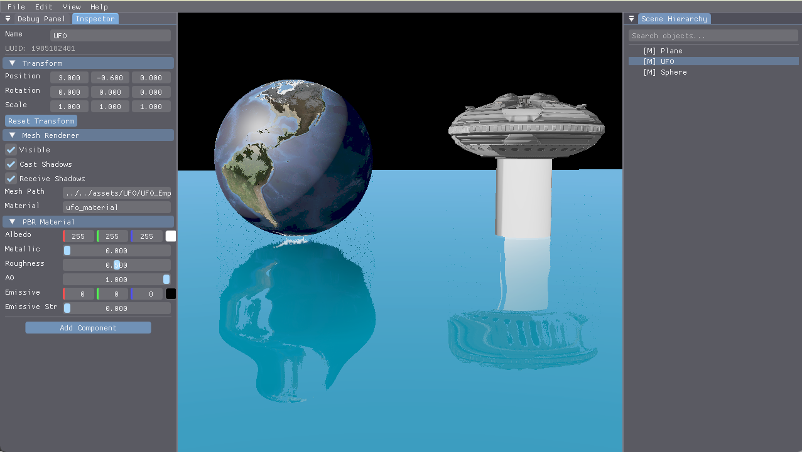

# 🎮 V Engine

**V Engine** 是一个基于 Vulkan 的现代游戏引擎，专注于图形渲染技术、ECS 架构和实时编辑器的学习与实践。



> 🚧 **开发中** - 该项目正在积极开发，API 可能会发生变化。

---

## ✨ 特性

### 🎨 渲染系统
- **双管线渲染** - 前向渲染 + 延迟渲染，可实时切换
- **G-Buffer** - 多渲染目标 (MRT)，存储世界位置/法线/Albedo/深度
- **PBR 材质** - Cook-Torrance BRDF，工业标准物理渲染
- **屏幕空间反射 (SSR)** - 实时反射效果，支持透视正确的射线步进
  - 基于线性深度的精确相交检测
  - 世界空间单位的厚度阈值（直观可调）
  - 二分搜索细化命中点
- **水面渲染** - 波纹动画 + 反射/折射 + 深度融合
  - 内置 SSR 反射（高效的逐水面像素计算）
  - 智能深度遮挡（结合世界高度 + 深度比较）
  - Fresnel 效应 + 边缘软化
- **Push Constants** - 高频数据传输，支持每实体独立变换矩阵

### 🏗️ 引擎架构
- **ECS 系统** - Entity-Component-System，基于 EnTT 库
- **模块化渲染通道** - 每个 Pass 独立管理 Pipeline、Descriptor、UBO
- **射线拾取** - 基于 AABB 包围盒的鼠标点击选择
- **场景层级** - 带变换继承的场景图系统
- **相机系统** - FPS 风格的第一人称相机控制

### 🖥️ 编辑器功能
- **ImGui 集成** - 现代化编辑器 UI
- **实时调试面板** - FPS、顶点数、三角形数统计
- **场景层级面板** - 可视化场景结构，支持选择和展开
- **属性检查器** - 实时编辑实体的变换、材质等属性
- **资源浏览器** - 文件系统浏览，支持资源预览

### 🔧 开发特性
- **热重载** - 支持拖拽加载 OBJ 模型
- **多几何体** - 内置球体、立方体、平面、自定义 OBJ 生成器
- **跨平台** - 支持 Windows 和 macOS
- **实时编辑** - 在 Inspector 中修改属性立即生效

---

## 📁 项目结构

```
VEngine/
├── src/
│   ├── core/                    # 核心系统
│   │   ├── VulkanDevice.*       # Vulkan 设备管理
│   │   ├── VulkanSwapChain.*    # 交换链管理
│   │   ├── VulkanBuffer.*       # GPU 缓冲区封装
│   │   └── VulkanTexture.*      # 纹理资源管理
│   │
│   ├── renderer/                # 渲染器
│   │   └── VulkanRenderer.*     # 主渲染器 (协调各 Pass)
│   │
│   ├── passes/                  # 渲染通道 (模块化)
│   │   ├── RenderPassBase.h     # 渲染通道基类
│   │   ├── ForwardPass.*        # 前向渲染通道
│   │   ├── GBufferPass.*        # G-Buffer 通道 (延迟渲染第一阶段)
│   │   ├── LightingPass.*       # 光照通道 (延迟渲染第二阶段)
│   │   ├── SSRPass.*            # 屏幕空间反射通道
│   │   └── WaterPass.*          # 水面渲染通道
│   │
│   ├── scene/                   # ECS 场景管理
│   │   ├── Scene.*              # 场景容器 (管理 EnTT Registry)
│   │   ├── Entity.*             # 实体封装 (EnTT Entity 的友好接口)
│   │   ├── Components.h         # ECS 组件定义
│   │   ├── Camera.*             # 相机系统
│   │   ├── Mesh.*               # 网格几何体
│   │   ├── RayPicker.*          # 射线拾取 (3D 物体选择)
│   │   └── SelectionManager.*   # 选择状态管理
│   │
│   ├── ui/                      # 编辑器 UI
│   │   ├── ImGuiLayer.*         # ImGui 集成层
│   │   ├── UIManager.*          # UI 面板管理器
│   │   └── panels/              # UI 面板
│   │       ├── DebugPanel.*     # 调试信息面板
│   │       ├── SceneHierarchyPanel.*  # 场景层级面板
│   │       ├── InspectorPanel.* # 属性检查器面板
│   │       └── AssetBrowserPanel.*    # 资源浏览器面板
│   │
│   └── main.cpp                 # 程序入口
│
├── shaders/                     # GLSL 着色器
│   ├── pbr.vert/frag            # PBR 前向渲染
│   ├── gbuffer.vert/frag        # G-Buffer 几何通道
│   ├── deferred_lighting.vert/frag  # 延迟光照通道
│   ├── ssr.vert/frag            # 屏幕空间反射
│   └── water.vert/frag          # 水面着色器
│
├── assets/                      # 资源文件
│   └── Earth/                   # 示例模型和纹理
│
└── build/                       # 构建输出
    └── bin/                     # 可执行文件
```

---

## 🖥️ 渲染管线

### 延迟渲染流程 (Water Scene Mode)

```
┌─────────────────────────────────────────────────────────────────┐
│                     Deferred Shading Pipeline                    │
├─────────────────────────────────────────────────────────────────┤
│                                                                  │
│  Pass 1: G-Buffer Pass                                          │
│  ┌──────────────────────────────────────────────────────────┐   │
│  │  输入: 场景几何体 (Mesh)                                   │   │
│  │  输出: Position | Normal | Albedo | Depth                 │   │
│  │  着色器: gbuffer.vert + gbuffer.frag                      │   │
│  └──────────────────────────────────────────────────────────┘   │
│                              │                                   │
│                              ▼                                   │
│  Pass 2: SSR Pass                                               │
│  ┌──────────────────────────────────────────────────────────┐   │
│  │  输入: G-Buffer (Position, Normal, Depth) + SceneColor   │   │
│  │  输出: Reflection Texture                                 │   │
│  │  算法: Screen-Space Raymarching                          │   │
│  └──────────────────────────────────────────────────────────┘   │
│                              │                                   │
│                              ▼                                   │
│  Pass 3: Lighting Pass (Fullscreen Quad)                        │
│  ┌──────────────────────────────────────────────────────────┐   │
│  │  输入: G-Buffer (Position, Normal, Albedo)               │   │
│  │  输出: Lit Scene Color                                    │   │
│  │  算法: Cook-Torrance BRDF (PBR)                          │   │
│  │  着色器: deferred_lighting.vert + deferred_lighting.frag │   │
│  └──────────────────────────────────────────────────────────┘   │
│                              │                                   │
│                              ▼                                   │
│  Pass 4: Water Pass                                             │
│  ┌──────────────────────────────────────────────────────────┐   │
│  │  输入: SSR Reflection + Scene Depth + Scene Color        │   │
│  │  输出: Final Water Surface                                │   │
│  │  特效: 波纹动画 + 反射 + 折射                             │   │
│  └──────────────────────────────────────────────────────────┘   │
│                              │                                   │
│                              ▼                                   │
│                      ┌─────────────┐                            │
│                      │  Swapchain  │                            │
│                      └─────────────┘                            │
└─────────────────────────────────────────────────────────────────┘
```

### 前向渲染流程 (Normal Mode)

```
┌────────────────────────────────────────────┐
│          Forward Rendering Pipeline         │
├────────────────────────────────────────────┤
│                                             │
│  Single Pass:                               │
│  ┌───────────────────────────────────────┐ │
│  │  输入: Mesh + Textures + UBO          │ │
│  │  输出: Final Color                    │ │
│  │  着色器: pbr.vert + pbr.frag          │ │
│  │  算法: Cook-Torrance BRDF             │ │
│  └───────────────────────────────────────┘ │
│                    │                        │
│                    ▼                        │
│            ┌─────────────┐                 │
│            │  Swapchain  │                 │
│            └─────────────┘                 │
└────────────────────────────────────────────┘
```

---

## 🎮 控制说明

### 相机控制
| 按键 | 功能 |
|------|------|
| `W/A/S/D` | 相机移动 |
| `Space` | 相机上升 |
| `Shift` | 相机下降 |
| `鼠标右键 + 移动` | 相机旋转 |
| `鼠标滚轮` | 调整 FOV (缩放) |

### 场景交互
| 操作 | 功能 |
|------|------|
| `鼠标左键` | **射线拾取选择物体** |
| `鼠标左键 (UI)` | UI 面板交互 |

### 几何体切换
| 按键 | 功能 |
|------|------|
| `1` | 切换到球体 (默认) |
| `2` | 切换到立方体 |
| `3` | 切换到平面 |
| `4` | 加载预设 OBJ 模型 |
| `拖拽 .obj 文件` | **加载自定义 OBJ 模型** |

### 渲染模式
| 按键 | 功能 |
|------|------|
| `5` | **切换水面场景 (启用延迟渲染)** |
| `F1` | **切换 UI 显示/隐藏** |
| `ESC` | 退出程序 |

## 🎯 编辑器 UI 面板

### 调试面板 (Debug Panel)
- **性能监控** - 实时 FPS、帧时间统计
- **渲染统计** - 顶点数、三角形数、绘制调用数
- **相机信息** - 位置、FOV、朝向

### 场景层级面板 (Scene Hierarchy)
- **实体树形视图** - 可展开/折叠的场景结构
- **实体选择** - 点击选择实体，与 3D 视图同步
- **实体类型图标** - Camera、Mesh、Light 等类型可视化

### 属性检查器面板 (Inspector)
- **变换组件** - 实时编辑位置、旋转、缩放
  - Position (X, Y, Z)
  - Rotation (X, Y, Z) - 欧拉角度
  - Scale (X, Y, Z)
- **网格渲染器组件** - 网格和材质引用
- **实时更新** - 修改后立即在 3D 视图中生效

### 资源浏览器面板 (Asset Browser)
- **文件系统浏览** - 递归显示 assets/ 目录
- **文件类型过滤** - 支持 .obj、.jpg、.png 等格式
- **拖拽加载** - 将模型文件拖入 3D 视图

---

## 🛠️ 构建指南

### 系统要求

- **Windows 10/11** 或 **macOS 10.15+**
- **Vulkan SDK 1.3+**
- **CMake 3.16+**
- **C++17 编译器** (MSVC 2019+ / Clang 12+)

### 依赖库

| 库 | 用途 |
|---|---|
| Vulkan | 图形 API |
| GLFW | 窗口和输入 |
| GLM | 数学库 |
| stb_image | 图像加载 |
| tinyobjloader | OBJ 模型加载 |

### Windows 构建

```bash
# 克隆项目
git clone <repository-url>
cd VEngine

# 创建构建目录
mkdir build && cd build

# 配置 (Visual Studio 2022)
cmake .. -G "Visual Studio 17 2022" -A x64

# 构建
cmake --build . --config Release

# 运行
cd bin
./VulkanPBR.exe
```

### macOS 构建

```bash
# 安装依赖
brew install cmake glfw glm

# 配置
mkdir build && cd build
cmake .. -DCMAKE_BUILD_TYPE=Release

# 构建
make -j$(sysctl -n hw.ncpu)

# 运行
./bin/VulkanPBR
```

### 编译着色器

```bash
cd shaders

# 编译所有着色器
glslc pbr.vert -o pbr_vert.spv
glslc pbr.frag -o pbr_frag.spv
glslc gbuffer.vert -o gbuffer_vert.spv
glslc gbuffer.frag -o gbuffer_frag.spv
glslc deferred_lighting.vert -o deferred_lighting_vert.spv
glslc deferred_lighting.frag -o deferred_lighting_frag.spv
glslc ssr.vert -o ssr_vert.spv
glslc ssr.frag -o ssr_frag.spv
glslc water.vert -o water_vert.spv
glslc water.frag -o water_frag.spv
```

---

## 🏛️ 架构设计

### 核心设计原则

1. **模块化 Pass** - 每个渲染阶段是独立的类，拥有自己的 Pipeline、Descriptor Pool、UBO
2. **资源独立** - Pass 之间不共享 Descriptor Set，通过拷贝数据保持独立性
3. **命令封装** - 原始 Vulkan 命令封装在各 Pass 类内部，Renderer 只调用高级接口

### 类图概览

```
┌─────────────────────────────────────────────────────────────────┐
│                        VulkanRenderer                            │
│  (主渲染器 - 协调所有 Pass，管理帧循环)                           │
└───────────────────────────────┬─────────────────────────────────┘
                                │
        ┌───────────────────────┼───────────────────────┐
        ▼                       ▼                       ▼
┌───────────────┐     ┌───────────────┐       ┌───────────────┐
│  ForwardPass  │     │ GBufferPass   │       │ LightingPass  │
│  前向渲染     │     │  几何阶段     │       │  光照阶段     │
└───────────────┘     └───────────────┘       └───────────────┘
                                │
        ┌───────────────────────┼───────────────────────┐
        ▼                       ▼                       ▼
┌───────────────┐     ┌───────────────┐       ┌───────────────┐
│   SSRPass     │     │  WaterPass    │       │    (更多...)   │
│  屏幕空间反射 │     │  水面渲染     │       │               │
└───────────────┘     └───────────────┘       └───────────────┘
        │                       │                       │
        └───────────────────────┼───────────────────────┘
                                ▼
                    ┌─────────────────────┐
                    │   RenderPassBase   │
                    │   (抽象基类)        │
                    └─────────────────────┘
```

### Pass 接口规范

```cpp
class RenderPassBase {
public:
    // 录制渲染命令
    virtual void recordCommands(VkCommandBuffer cmd, uint32_t frameIndex);
    
    // 窗口大小改变时重建
    virtual void resize(uint32_t width, uint32_t height);
    
    // 启用/禁用
    void setEnabled(bool enable);
};
```

---

## 🗺️ 路线图

### ✅ 已完成 (v0.9.1)
- [x] **Vulkan 渲染基础** - Device, SwapChain, Pipeline 管理
- [x] **PBR 材质系统** - Cook-Torrance BRDF，金属/非金属工作流
- [x] **双渲染管线** - 前向渲染 + 延迟渲染，可实时切换
- [x] **G-Buffer 实现** - 世界位置/法线/Albedo/深度四通道输出
- [x] **屏幕空间反射 (SSR)** - 透视正确的射线步进，线性深度精确相交
- [x] **水面渲染系统** - 波纹动画 + SSR 反射 + 智能深度遮挡
- [x] **线性深度系统** - NDC 空间步进 + 线性深度比较，解决远距离精度问题
- [x] **ECS 架构** - 基于 EnTT 的实体组件系统
- [x] **射线拾取** - AABB 包围盒交集检测，支持 3D 物体选择
- [x] **编辑器 UI** - ImGui 集成，多面板布局
  - 调试面板 (性能监控)
  - 场景层级面板 (实体管理)
  - 属性检查器 (实时编辑)
  - 资源浏览器 (文件管理)
- [x] **Push Constants** - 高频数据传输，每实体独立变换矩阵
- [x] **资源管理** - OBJ 模型加载，纹理管理，拖拽支持
- [x] **相机系统** - FPS 风格第一人称相机，平滑移动

### 🚀 计划中 (v1.0.0)
- [ ] **多光源支持** - 点光源、聚光灯、方向光数组
- [ ] **阴影系统** - Shadow Mapping / Cascaded Shadow Maps (CSM)
- [ ] **环境光遮蔽** - Screen-Space Ambient Occlusion (SSAO)
- [ ] **后处理管线** - Bloom, Tone Mapping, Anti-Aliasing (FXAA/TAA)
- [ ] **天空盒系统** - HDR 环境贴图 + IBL (基于图像的光照)
- [ ] **材质编辑器** - 节点式材质编辑，实时预览
- [ ] **场景序列化** - JSON 格式场景保存/加载

### 🌟 长期规划 (v2.0+)
- [ ] **骨骼动画** - Skinned Mesh Animation + 动画状态机
- [ ] **物理系统** - 碰撞检测 + 刚体物理 (Bullet Physics 集成)
- [ ] **粒子系统** - GPU Compute Shader 驱动的粒子渲染
- [ ] **地形系统** - Heightmap + 多纹理混合 + LOD
- [ ] **音频系统** - 3D 空间音效 + 音频资源管理
- [ ] **脚本系统** - Lua/C# 脚本绑定 + 热重载
- [ ] **网络架构** - 多人游戏网络同步框架

---

## � 技术细节

### 屏幕空间反射 (SSR) 算法

SSR 采用透视正确的屏幕空间射线步进，核心技术要点：

#### 1. 透视正确的射线步进
```glsl
// 在 NDC 空间步进（保持透视正确性）
vec3 startScreen = worldToScreen(rayOrigin);  // (UV.x, UV.y, NDC_depth)
vec3 endScreen = worldToScreen(rayOrigin + rayDir * maxDistance);
vec3 stepScreen = (endScreen - startScreen) / numSteps;
```

#### 2. 线性深度比较
```glsl
// 深度线性化公式（Vulkan 标准深度范围 [0,1]）
float linearizeDepth(float depth) {
    return near * far / (far - depth * (far - near));
}

// 比较时使用线性深度，支持世界单位的厚度阈值
float sampledLinearDepth = linearizeDepth(texture(gDepth, uv).r);
float rayLinearDepth = linearizeDepth(currentNDCDepth);
float deltaDepth = rayLinearDepth - sampledLinearDepth;

if (deltaDepth > 0.0 && deltaDepth < thickness) {
    // 命中！
}
```

#### 3. 参数说明
| 参数 | 默认值 | 说明 |
|------|--------|------|
| `maxDistance` | 50.0 | 最大射线步进距离（世界单位） |
| `maxSteps` | 64 | 最大步进次数 |
| `thickness` | 0.01 | 表面厚度阈值（世界单位，米） |

### 水面深度遮挡逻辑

水面渲染采用智能遮挡判断，结合**世界空间高度**和**深度比较**：

```glsl
float heightDiff = sceneWorldPos.y - waterHeight;  // 物体相对水面高度
float depthDiff = sceneLinearDepth - waterLinearDepth;  // 深度差

// 情况1：物体在水面上方且离相机更近 → 遮挡水面
if (heightDiff > 0.01 && depthDiff < 0.0) {
    edgeSoftness = smoothstep(-0.05, 0.0, depthDiff);
}
// 情况2：物体在水面下方 → 水面始终可见
else if (heightDiff < -0.01) {
    edgeSoftness = 1.0;
}
```

这种方法解决了以下问题：
- ✅ 水下物体不会错误地遮挡水面
- ✅ 相机高度变化时保持正确的遮挡关系
- ✅ 水面边缘柔和过渡

---

## �📚 参考资料

- [Vulkan Tutorial](https://vulkan-tutorial.com/)
- [Learn OpenGL - PBR](https://learnopengl.com/PBR/Theory)
- [Real-Time Rendering 4th Edition](http://www.realtimerendering.com/)
- [GDC - Deferred Shading](https://www.gdcvault.com/)

---

## 📄 许可证

MIT License - 详见 [LICENSE](LICENSE) 文件

---

<p align="center">
  <b>V Engine</b> - 构建你的游戏世界 �
</p>
