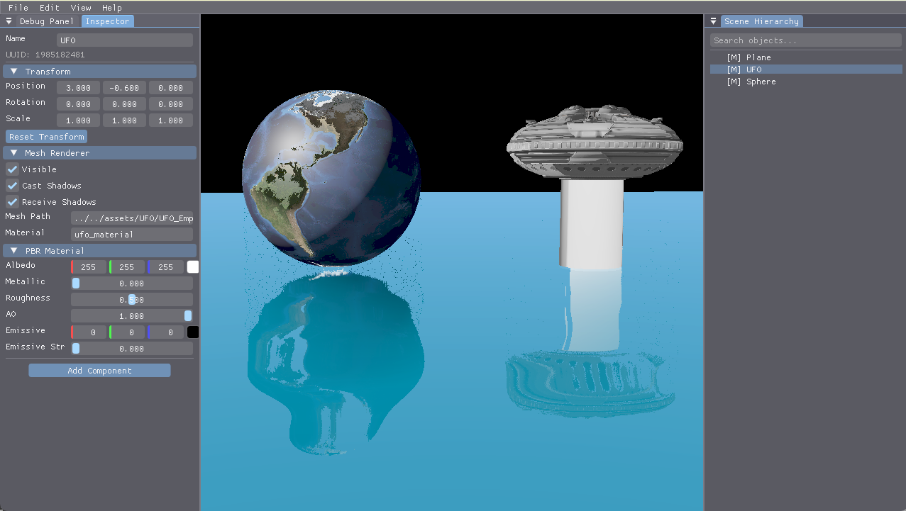

# 🎮 V Engine

**V Engine** 是一个基于 Vulkan 的现代游戏引擎，专注于图形渲染技术、ECS 架构和实时编辑器的学习与实践。



> 🚧 **开发中** - 该项目正在积极开发，API 可能会发生变化。

---

## ✨ 特性

### 🎨 渲染系统
- **双管线渲染** - 前向渲染 + 延迟渲染，可实时切换
- **G-Buffer** - 多渲染目标 (MRT)，存储世界位置/法线/Albedo/深度
- **PBR 材质** - Cook-Torrance BRDF，工业标准物理渲染
- **屏幕空间反射 (SSR)** - 实时反射效果，支持透视正确的射线步进
  - 基于线性深度的精确相交检测
  - 世界空间单位的厚度阈值（直观可调）
  - 二分搜索细化命中点
- **水面渲染** - 波纹动画 + 反射/折射 + 深度融合
  - 内置 SSR 反射（高效的逐水面像素计算）
  - 智能深度遮挡（结合世界高度 + 深度比较）
  - Fresnel 效应 + 边缘软化
- **Push Constants** - 高频数据传输，支持每实体独立变换矩阵

### 🚀 GPU-Driven / Nanite 系统
- **GPU 视锥剔除** - Compute Shader 驱动的实例级视锥剔除
- **Nanite Mesh Clustering** - 类 UE5 的虚拟几何系统
  - **METIS 风格多级图分区算法**（与 UE Nanite 相同）
  - 重边缘匹配（Heavy Edge Matching）粗化
  - KL/FM 风格局部细化（边界优化）
  - 16-bit 顶点量化（内存带宽优化）
  - 法线锥背面剔除（整 Cluster 级别）
  - GPU Storage Buffer 管理
- **动态 LOD 选择** - 基于距离的自动 LOD 切换
  - 屏幕空间误差计算
  - DAG 层级遍历（父子 Cluster 关系）
  - 互斥渲染（避免 Z-Fighting）
- **间接绘制** - `vkCmdDrawIndexedIndirect` 减少 CPU-GPU 通信

### 🏗️ 引擎架构 (v1.0 新架构)
- **模块化设计** - 参考 Unreal Engine 架构，职责清晰分离
- **ECS 系统** - Entity-Component-System，基于 EnTT 库
- **RHI 抽象层** - Vulkan 资源管理与同步抽象
- **SceneRenderer** - 渲染通道调度器，管理多 Pass 渲染流程
- **射线拾取** - 基于 AABB 包围盒的鼠标点击选择
- **场景层级** - 带变换继承的场景图系统
- **相机系统** - FPS 风格的第一人称相机控制

### 🖥️ 编辑器功能
- **ImGui 集成** - 现代化编辑器 UI
- **实时调试面板** - FPS、顶点数、三角形数统计
- **场景层级面板** - 可视化场景结构，支持选择和展开
- **属性检查器** - 实时编辑实体的变换、材质等属性
- **资源浏览器** - 文件系统浏览，支持资源预览

### 🔧 开发特性
- **热重载** - 支持拖拽加载 OBJ 模型
- **多几何体** - 内置球体、立方体、平面、自定义 OBJ 生成器
- **跨平台** - 支持 Windows 和 macOS
- **实时编辑** - 在 Inspector 中修改属性立即生效

---

## 📁 项目结构 (v1.0 新架构)

```
VEngine/
├── src/
│   ├── Application/              # 应用程序层
│   │   ├── Engine.*              # 引擎主入口 (生命周期管理)
│   │   ├── Window.*              # 窗口管理 (GLFW 封装)
│   │   └── Input.*               # 输入系统 (键盘/鼠标/手柄)
│   │
│   ├── RHI/                      # 渲染硬件接口 (Render Hardware Interface)
│   │   ├── VulkanDevice.*        # Vulkan 设备管理 (Instance, Device, Queue)
│   │   ├── VulkanSwapChain.*     # 交换链管理
│   │   ├── VulkanBuffer.*        # GPU 缓冲区封装
│   │   ├── VulkanTexture.*       # 纹理资源管理
│   │   ├── VulkanPipeline.*      # 图形管线封装
│   │   ├── ComputePipeline.*     # 计算管线封装
│   │   └── FrameResources.*      # 帧资源管理 (命令缓冲、同步对象)
│   │
│   ├── renderer/                 # 渲染器模块
│   │   ├── SceneRenderer.*       # 场景渲染调度器 (管理所有 Pass)
│   │   ├── VulkanRenderer.*      # 兼容旧架构的渲染器
│   │   ├── nanite/               # Nanite 虚拟几何系统
│   │   │   ├── Nanite.h              # 配置常量和统计
│   │   │   ├── NaniteCluster.*       # Cluster 数据结构 (GPU 对齐)
│   │   │   ├── MeshClusterizer.*     # 网格分簇算法 (METIS 多级图分区)
│   │   │   ├── MeshSimplifier.*      # QEM 网格简化 (LOD 生成)
│   │   │   └── NaniteManager.*       # 全局管理器 (GPU 缓冲)
│   │   └── passes/               # 渲染通道 (模块化)
│   │       ├── RenderPassBase.h      # 渲染通道基类
│   │       ├── RenderContext.h       # 渲染上下文 (矩阵、时间等)
│   │       ├── ComputePassBase.*     # 计算通道基类
│   │       ├── ForwardPass.*         # 前向渲染通道
│   │       ├── GBufferPass.*         # G-Buffer 通道 (延迟渲染)
│   │       ├── LightingPass.*        # �光照通道
│   │       ├── SSRPass.*             # 屏幕空间反射通道
│   │       ├── WaterPass.*           # 水面渲染通道
│   │       ├── ClusterCullingPass.*  # Nanite Cluster 剔除
│   │       ├── NaniteDebugPass.*     # Nanite 调试可视化
│   │       ├── FrustumCullingPass.*  # GPU 视锥剔除
│   │       └── GPUDrivenRenderer.*   # GPU-Driven 渲染管理器
│   │
│   ├── scene/                    # ECS 场景管理
│   │   ├── Scene.*               # 场景容器 (管理 EnTT Registry)
│   │   ├── Entity.*              # 实体封装 (EnTT 友好接口)
│   │   ├── Components.h          # ECS 组件定义
│   │   ├── SceneManager.*        # 场景生命周期管理
│   │   ├── RayPicker.*           # 射线拾取 (3D 物体选择)
│   │   └── SelectionManager.*    # 选择状态管理
│   │
│   ├── resources/                # 资源管理
│   │   ├── Mesh.*                # 网格几何体
│   │   ├── Material.*            # 材质资源
│   │   ├── MeshManager.h         # 网格缓存管理器
│   │   ├── TextureManager.h      # 纹理缓存管理器
│   │   └── RenderSystem.h        # ECS 渲染系统组件
│   │
│   ├── World/                    # 世界系统
│   │   └── Camera.*              # 相机系统
│   │
│   ├── ui/                       # 编辑器 UI
│   │   ├── ImGuiLayer.*          # ImGui 集成层
│   │   ├── UIManager.*           # UI 面板管理器
│   │   └── panels/               # UI 面板
│   │       ├── DebugPanel.*          # 调试信息面板
│   │       ├── SceneHierarchyPanel.* # 场景层级面板
│   │       ├── InspectorPanel.*      # 属性检查器面板
│   │       └── AssetBrowserPanel.*   # 资源浏览器面板
│   │
│   ├── Core/                     # 核心工具
│   │   └── Utils.*               # 通用工具函数
│   │
│   └── main.cpp                  # 程序入口
│
├── shaders/                      # GLSL 着色器
│   ├── pbr.vert/frag             # PBR 前向渲染
│   ├── gbuffer.vert/frag         # G-Buffer 几何通道
│   ├── deferred_lighting.vert/frag  # 延迟光照通道
│   ├── ssr.vert/frag             # 屏幕空间反射
│   ├── water.vert/frag           # 水面着色器
│   └── nanite/                   # Nanite 专用着色器
│       ├── cluster_culling.comp  # Cluster 剔除计算着色器
│       └── cluster_debug.*       # 调试可视化着色器
│
├── docs/                         # 项目文档
│   ├── README.md                 # 文档索引
│   ├── architecture/             # 架构设计文档
│   ├── core/                     # 核心系统文档
│   ├── gpu-driven-rendering/     # GPU 驱动渲染文档
│   └── nanite/                   # Nanite 系统文档
│
├── assets/                       # 资源文件
│   ├── Earth/                    # 地球模型和纹理
│   └── UFO/                      # UFO 模型和纹理
│
└── build/                        # 构建输出
    └── bin/                      # 可执行文件
```

---

## 🏛️ 架构设计 (v1.0 新架构)

### 整体架构图

```
┌─────────────────────────────────────────────────────────────────────────┐
│                              Application Layer                           │
│  ┌─────────────────────────────────────────────────────────────────┐    │
│  │                           Engine                                 │    │
│  │  ┌─────────┐  ┌─────────┐  ┌─────────┐  ┌─────────┐             │    │
│  │  │ Window  │  │  Input  │  │ Camera  │  │  Scene  │             │    │
│  │  └─────────┘  └─────────┘  └─────────┘  └─────────┘             │    │
│  └─────────────────────────────────────────────────────────────────┘    │
└─────────────────────────────────────────────────────────────────────────┘
                                    │
                                    ▼
┌─────────────────────────────────────────────────────────────────────────┐
│                              Renderer Layer                              │
│  ┌─────────────────────────────────────────────────────────────────┐    │
│  │                        SceneRenderer                             │    │
│  │  ┌──────────────────────────────────────────────────────────┐   │    │
│  │  │                    RenderPassBase                         │   │    │
│  │  │  ┌───────────┐ ┌───────────┐ ┌───────────┐ ┌──────────┐  │   │    │
│  │  │  │ GBuffer   │ │ Lighting  │ │  Forward  │ │  Water   │  │   │    │
│  │  │  │   Pass    │→│   Pass    │ │   Pass    │ │   Pass   │  │   │    │
│  │  │  └───────────┘ └───────────┘ └───────────┘ └──────────┘  │   │    │
│  │  └──────────────────────────────────────────────────────────┘   │    │
│  └─────────────────────────────────────────────────────────────────┘    │
│  ┌─────────────────────────────────────────────────────────────────┐    │
│  │                         RenderSystem                             │    │
│  │   (ECS 系统: 收集可渲染实体, 分配到各个 Pass)                      │    │
│  └─────────────────────────────────────────────────────────────────┘    │
└─────────────────────────────────────────────────────────────────────────┘
                                    │
                                    ▼
┌─────────────────────────────────────────────────────────────────────────┐
│                                RHI Layer                                 │
│  ┌───────────┐  ┌───────────┐  ┌───────────┐  ┌─────────────────────┐   │
│  │  Vulkan   │  │  Vulkan   │  │   Frame   │  │   VulkanBuffer/     │   │
│  │  Device   │  │ SwapChain │  │ Resources │  │   VulkanTexture     │   │
│  └───────────┘  └───────────┘  └───────────┘  └─────────────────────┘   │
└─────────────────────────────────────────────────────────────────────────┘
                                    │
                                    ▼
┌─────────────────────────────────────────────────────────────────────────┐
│                              ECS / Scene                                 │
│  ┌───────────────────────────────────────────────────────────────────┐  │
│  │  Scene (EnTT Registry)                                            │  │
│  │  ┌─────────────────────────────────────────────────────────────┐  │  │
│  │  │  Entity                                                     │  │  │
│  │  │  ├── TransformComponent                                     │  │  │
│  │  │  ├── MeshRendererComponent                                  │  │  │
│  │  │  ├── PBRMaterialComponent                                   │  │  │
│  │  │  ├── LightComponent                                         │  │  │
│  │  │  └── TagComponent                                           │  │  │
│  │  └─────────────────────────────────────────────────────────────┘  │  │
│  └───────────────────────────────────────────────────────────────────┘  │
└─────────────────────────────────────────────────────────────────────────┘
```

### 核心设计原则

1. **职责分离** - 每个模块只负责单一功能
   - `Engine`: 应用程序生命周期管理
   - `SceneRenderer`: 渲染通道调度
   - `RenderSystem`: ECS 实体到渲染数据的转换
   - `RHI`: Vulkan 资源管理

2. **模块化 Pass** - 每个渲染阶段是独立的类
   - 拥有自己的 Pipeline、Descriptor Pool、UBO
   - 通过 `RenderContext` 共享渲染状态

3. **RenderContext** - 统一的渲染上下文
   ```cpp
   struct RenderContext {
       VkCommandBuffer commandBuffer;
       uint32_t frameIndex;
       uint32_t imageIndex;
       
       // 相机数据
       glm::mat4 viewMatrix;
       glm::mat4 projectionMatrix;
       glm::vec3 cameraPosition;
       
       // 时间数据
       float deltaTime;
       float time;
       
       // 场景引用
       Camera* camera;
       Scene* scene;
   };
   ```

4. **ECS 驱动渲染** - 实体组件驱动渲染流程
   - `RenderSystem` 遍历所有带有 `MeshRendererComponent` 的实体
   - 根据材质类型分配到对应的渲染通道

### Pass 接口规范

```cpp
class RenderPassBase {
public:
    virtual ~RenderPassBase() = default;
    
    // 初始化资源
    virtual void initialize() = 0;
    
    // 录制渲染命令
    virtual void render(const RenderContext& context) = 0;
    
    // 窗口大小改变时重建
    virtual void resize(uint32_t width, uint32_t height);
    
    // 启用/禁用
    void setEnabled(bool enable);
    bool isEnabled() const;
};
```

### Engine 生命周期

```cpp
class Engine {
public:
    Engine(const Config& config);
    ~Engine();
    
    void run();              // 主循环
    void requestExit();      // 请求退出
    
private:
    void initializeSubsystems();  // 初始化所有子系统
    void shutdownSubsystems();    // 反序关闭所有子系统
    void mainLoop();              // 单帧逻辑
    void recreateSwapChain();     // 窗口大小变化处理
    
    // 子系统 (按初始化顺序)
    std::unique_ptr<Window> m_window;
    std::unique_ptr<VulkanDevice> m_device;
    std::unique_ptr<VulkanSwapChain> m_swapChain;
    std::unique_ptr<FrameResources> m_frameResources;
    std::unique_ptr<Input> m_input;
    std::unique_ptr<Camera> m_camera;
    std::unique_ptr<Scene> m_scene;
    std::unique_ptr<RenderSystem> m_renderSystem;
    std::unique_ptr<SceneRenderer> m_renderer;
    std::unique_ptr<ImGuiLayer> m_imguiLayer;
    std::unique_ptr<UIManager> m_uiManager;
};
```

---

## 🖥️ 渲染管线

### 延迟渲染流程 (Water Scene Mode)

```
┌─────────────────────────────────────────────────────────────────┐
│                     Deferred Shading Pipeline                    │
├─────────────────────────────────────────────────────────────────┤
│                                                                  │
│  Pass 1: G-Buffer Pass                                          │
│  ┌──────────────────────────────────────────────────────────┐   │
│  │  输入: 场景几何体 (Mesh)                                   │   │
│  │  输出: Position | Normal | Albedo | Depth                 │   │
│  │  着色器: gbuffer.vert + gbuffer.frag                      │   │
│  └──────────────────────────────────────────────────────────┘   │
│                              │                                   │
│                              ▼                                   │
│  Pass 2: SSR Pass                                               │
│  ┌──────────────────────────────────────────────────────────┐   │
│  │  输入: G-Buffer (Position, Normal, Depth) + SceneColor   │   │
│  │  输出: Reflection Texture                                 │   │
│  │  算法: Screen-Space Raymarching                          │   │
│  └──────────────────────────────────────────────────────────┘   │
│                              │                                   │
│                              ▼                                   │
│  Pass 3: Lighting Pass (Fullscreen Quad)                        │
│  ┌──────────────────────────────────────────────────────────┐   │
│  │  输入: G-Buffer (Position, Normal, Albedo)               │   │
│  │  输出: Lit Scene Color                                    │   │
│  │  算法: Cook-Torrance BRDF (PBR)                          │   │
│  │  着色器: deferred_lighting.vert + deferred_lighting.frag │   │
│  └──────────────────────────────────────────────────────────┘   │
│                              │                                   │
│                              ▼                                   │
│  Pass 4: Water Pass                                             │
│  ┌──────────────────────────────────────────────────────────┐   │
│  │  输入: SSR Reflection + Scene Depth + Scene Color        │   │
│  │  输出: Final Water Surface                                │   │
│  │  特效: 波纹动画 + 反射 + 折射                             │   │
│  └──────────────────────────────────────────────────────────┘   │
│                              │                                   │
│                              ▼                                   │
│                      ┌─────────────┐                            │
│                      │  Swapchain  │                            │
│                      └─────────────┘                            │
└─────────────────────────────────────────────────────────────────┘
```

### 前向渲染流程 (Normal Mode)

```
┌────────────────────────────────────────────┐
│          Forward Rendering Pipeline         │
├────────────────────────────────────────────┤
│                                             │
│  Single Pass:                               │
│  ┌───────────────────────────────────────┐ │
│  │  输入: Mesh + Textures + UBO          │ │
│  │  输出: Final Color                    │ │
│  │  着色器: pbr.vert + pbr.frag          │ │
│  │  算法: Cook-Torrance BRDF             │ │
│  └───────────────────────────────────────┘ │
│                    │                        │
│                    ▼                        │
│            ┌─────────────┐                 │
│            │  Swapchain  │                 │
│            └─────────────┘                 │
└────────────────────────────────────────────┘
```

---

## 🎮 控制说明

### 相机控制
| 按键 | 功能 |
|------|------|
| `W/A/S/D` | 相机移动 |
| `Space` | 相机上升 |
| `Shift` | 相机下降 |
| `鼠标右键 + 移动` | 相机旋转 |
| `鼠标滚轮` | 调整 FOV (缩放) |

### 场景交互
| 操作 | 功能 |
|------|------|
| `鼠标左键` | **射线拾取选择物体** |
| `鼠标左键 (UI)` | UI 面板交互 |

### 几何体切换
| 按键 | 功能 |
|------|------|
| `1` | 切换到球体 (默认) |
| `2` | 切换到立方体 |
| `3` | 切换到平面 |
| `4` | 加载预设 OBJ 模型 |
| `拖拽 .obj 文件` | **加载自定义 OBJ 模型** |

### 渲染模式
| 按键 | 功能 |
|------|------|
| `5` | **切换水面场景 (启用延迟渲染)** |
| `F1` | **切换 UI 显示/隐藏** |
| `ESC` | 退出程序 |

### Nanite 调试
| 按键 | 功能 |
|------|------|
| `7` | **切换 Nanite 渲染 开/关** |
| `8` | **测试 Mesh Clustering (生成 Cluster)** |

---

## 🛠️ 构建指南

### 系统要求

- **Windows 10/11** 或 **macOS 10.15+**
- **Vulkan SDK 1.3+**
- **CMake 3.16+**
- **C++17 编译器** (MSVC 2019+ / Clang 12+)

### 依赖库

| 库 | 用途 |
|---|---|
| Vulkan | 图形 API |
| GLFW | 窗口和输入 |
| GLM | 数学库 |
| EnTT | ECS 框架 |
| ImGui | 编辑器 UI |
| stb_image | 图像加载 |
| tinyobjloader | OBJ 模型加载 |

### Windows 构建

```bash
# 克隆项目
git clone <repository-url>
cd VEngine

# 创建构建目录
mkdir build && cd build

# 配置 (Visual Studio 2022)
cmake .. -G "Visual Studio 17 2022" -A x64

# 构建
cmake --build . --config Release

# 运行
cd bin
./VulkanPBR.exe
```

### macOS 构建

```bash
# 安装依赖
brew install cmake glfw glm

# 配置
mkdir build && cd build
cmake .. -DCMAKE_BUILD_TYPE=Release

# 构建
make -j$(sysctl -n hw.ncpu)

# 运行
./bin/VulkanPBR
```

---

## 🗺️ 路线图

### ✅ 已完成 (v1.0.0) - 模块化架构重构
- [x] **新架构设计** - 参考 Unreal Engine 的模块化设计
  - Engine 应用程序层
  - RHI 渲染硬件抽象层
  - SceneRenderer 渲染调度器
  - RenderPassBase 渲染通道基类
  - RenderContext 渲染上下文
- [x] **ECS 系统增强** - 基于 EnTT 的完整实体组件系统
  - Scene 管理 Registry
  - Entity 友好封装
  - Components 组件定义
  - RenderSystem 渲染系统
- [x] **资源管理** - 统一的资源加载和缓存
  - MeshManager 网格管理器
  - TextureManager 纹理管理器
  - Material 材质系统

### ✅ 已完成 (v0.9.x)
- [x] **Vulkan 渲染基础** - Device, SwapChain, Pipeline 管理
- [x] **PBR 材质系统** - Cook-Torrance BRDF，金属/非金属工作流
- [x] **双渲染管线** - 前向渲染 + 延迟渲染，可实时切换
- [x] **G-Buffer 实现** - 世界位置/法线/Albedo/深度四通道输出
- [x] **屏幕空间反射 (SSR)** - 透视正确的射线步进，线性深度精确相交
- [x] **水面渲染系统** - 波纹动画 + SSR 反射 + 智能深度遮挡
- [x] **GPU-Driven / Nanite** - GPU 视锥剔除、Mesh Clustering、动态 LOD
- [x] **编辑器 UI** - ImGui 集成，多面板布局

### 🔄 进行中 (v1.1.0)
- [ ] **网格简化算法** - 边折叠（Edge Collapse）生成多级 Cluster
- [ ] **屏幕空间误差 LOD** - 基于投影像素误差的精确 LOD 选择
- [ ] **Visibility Buffer** - 延迟材质着色，进一步减少 overdraw

### 🚀 计划中 (v1.2.0)
- [ ] **多光源支持** - 点光源、聚光灯、方向光数组
- [ ] **阴影系统** - Shadow Mapping / Cascaded Shadow Maps (CSM)
- [ ] **环境光遮蔽** - Screen-Space Ambient Occlusion (SSAO)
- [ ] **后处理管线** - Bloom, Tone Mapping, Anti-Aliasing (FXAA/TAA)
- [ ] **天空盒系统** - HDR 环境贴图 + IBL (基于图像的光照)
- [ ] **材质编辑器** - 节点式材质编辑，实时预览
- [ ] **场景序列化** - JSON 格式场景保存/加载

### 🌟 长期规划 (v2.0+)
- [ ] **骨骼动画** - Skinned Mesh Animation + 动画状态机
- [ ] **物理系统** - 碰撞检测 + 刚体物理 (Bullet Physics 集成)
- [ ] **粒子系统** - GPU Compute Shader 驱动的粒子渲染
- [ ] **地形系统** - Heightmap + 多纹理混合 + LOD
- [ ] **音频系统** - 3D 空间音效 + 音频资源管理
- [ ] **脚本系统** - Lua/C# 脚本绑定 + 热重载
- [ ] **网络架构** - 多人游戏网络同步框架

---

## 📚 参考资料

### 基础渲染
- [Vulkan Tutorial](https://vulkan-tutorial.com/)
- [Learn OpenGL - PBR](https://learnopengl.com/PBR/Theory)
- [Real-Time Rendering 4th Edition](http://www.realtimerendering.com/)
- [GDC - Deferred Shading](https://www.gdcvault.com/)

### 引擎架构
- [Game Engine Architecture (Jason Gregory)](https://www.gameenginebook.com/)
- [Unreal Engine Source Code](https://github.com/EpicGames/UnrealEngine)
- [The Cherno - Game Engine Series](https://www.youtube.com/playlist?list=PLlrATfBNZ98dC-V-N3m0Go4deliWHPFwT)

### GPU-Driven / Nanite
- [A Deep Dive into Nanite Virtualized Geometry (SIGGRAPH 2021)](https://advances.realtimerendering.com/s2021/)
- [GPU-Driven Rendering Pipelines (SIGGRAPH 2015)](http://advances.realtimerendering.com/s2015/)
- [Nanite | Inside Unreal](https://www.youtube.com/watch?v=eviSykqSUUw)
- [Mesh Shaders (NVIDIA)](https://developer.nvidia.com/blog/introduction-turing-mesh-shaders/)

---

## 📄 许可证

MIT License - 详见 [LICENSE](LICENSE) 文件

---

<p align="center">
  <b>V Engine</b> - 构建你的游戏世界 🎮
</p>